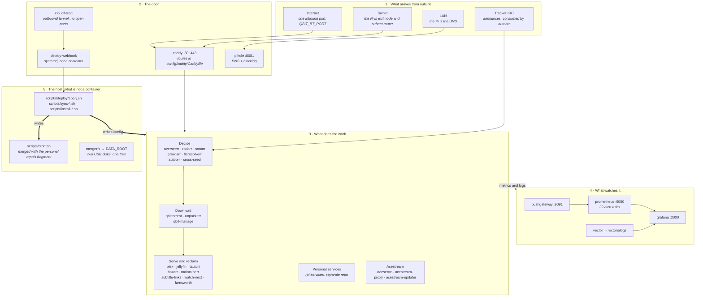
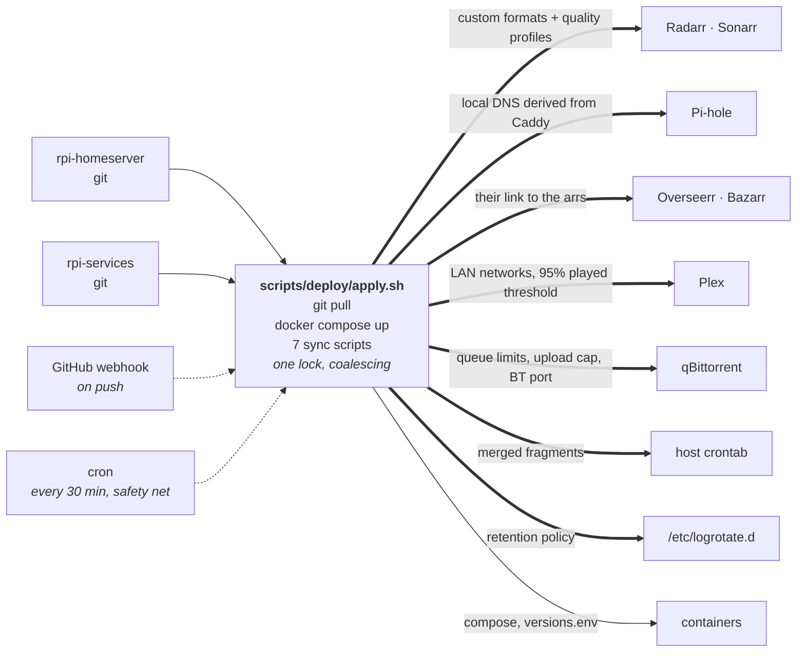
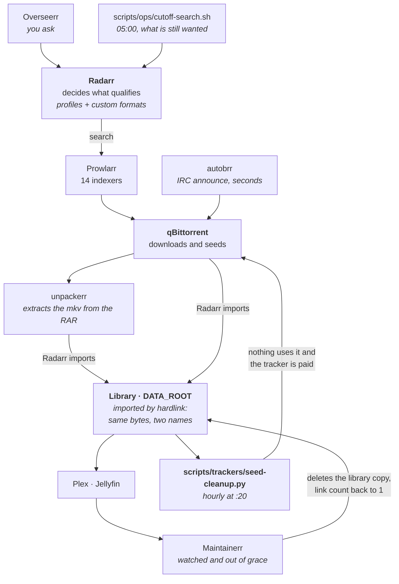
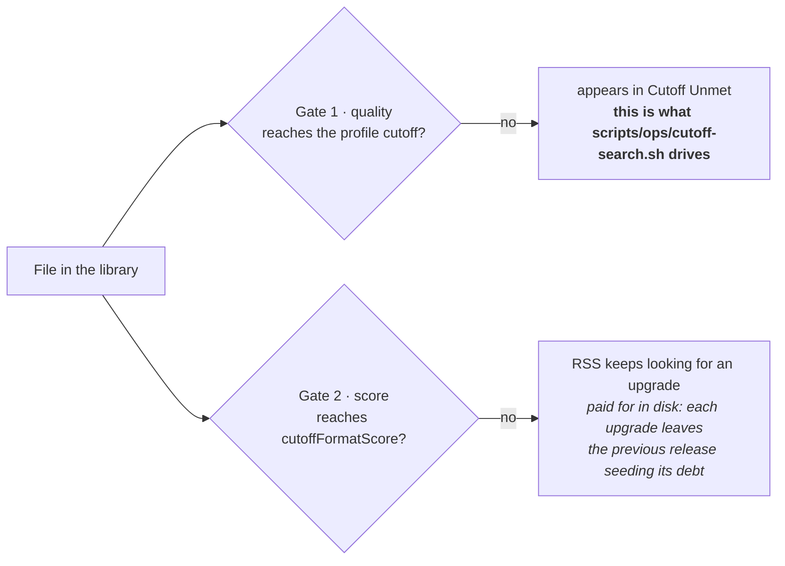
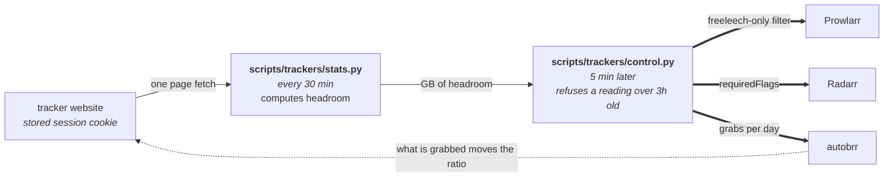
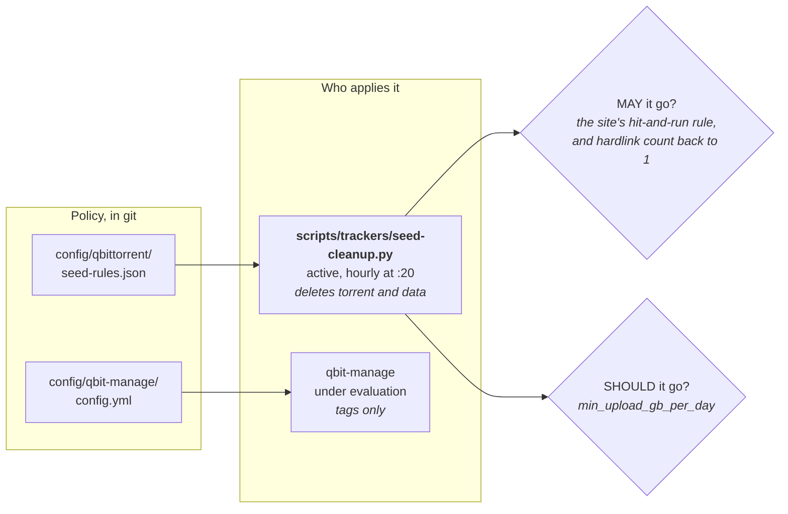
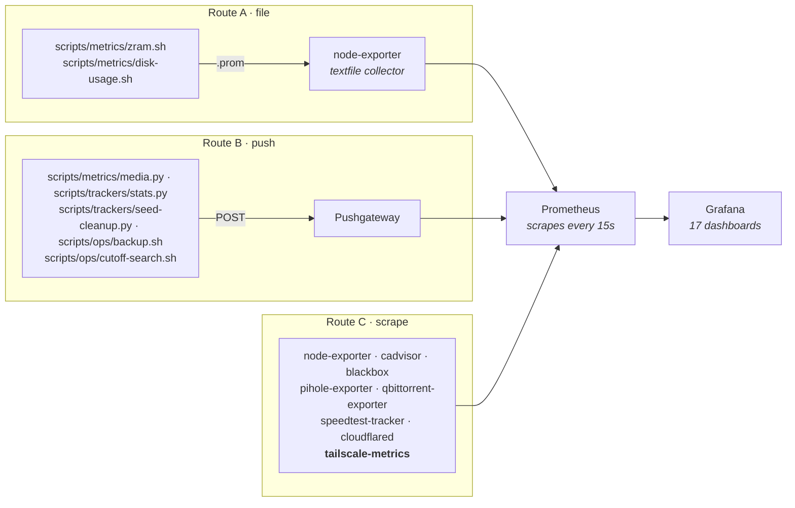

# Architecture

What talks to what, and which component is allowed to overwrite which app's configuration.

Diagrams are Mermaid, which GitHub renders inline. They are the first thing in this repo to use
it: an ASCII box drawing is fine for four boxes, and this file has more than forty.

Everything measured here was measured on 2026-08-22. Counts drift; the shapes do not.

---

## The five bands

41 containers plus one ephemeral at 03:00. All on `media-network` except Plex and Pi-hole, which
use the host network: Plex because it decides "local vs remote" from the source IP, Pi-hole
because it is the LAN's resolver.

---

## The convergence loop

Every 30 minutes, and on every push, `scripts/deploy/apply.sh` pulls both repos and pushes configuration into
each app. Every one of these arrows exists because that setting lives **only inside its app's
own `appdata`**: no compose file and no `.env` captures it, so without this a lost disk silently
loses hours of tuning.

The cron path is dotted because it is not the normal one: it is the net that catches pushes that
arrived while the Pi or the tunnel was down. The lock coalesces rather than queues, so ten pushes
during an ARM Go build cost exactly one extra pass.

### What can overwrite what

| Script | When | Writes into | Source of truth |
| :--- | :--- | :--- | :--- |
| `scripts/sync/arr-config.sh` | every deploy | Radarr, Sonarr | `config/arr/*/*.json` |
| `scripts/sync/qbit-config.sh` | every deploy | qBittorrent | `config/qbittorrent/preferences.json` + `QBIT_BT_PORT` |
| `scripts/sync/plex-prefs.sh` | every deploy | Plex | `PLEX_LAN_NETWORKS`, 95% threshold |
| `scripts/sync/arr-links.sh` | every deploy | Overseerr, Bazarr | `config/overseerr-links.json` |
| `scripts/sync/pihole-dns.sh` | every deploy | Pi-hole | the Caddy config, additive only |
| `scripts/deploy/install-crontab.sh` | every deploy | host crontab | both repos' `scripts/crontab` |
| `scripts/deploy/install-logrotate.sh` | every deploy | `/etc/logrotate.d` | `config/logrotate/rpi-homeserver` |
| `scripts/trackers/control.py` | :05 and :35 | Prowlarr, Radarr, autobrr | the measured ratio headroom |
| `scripts/trackers/seed-cleanup.py` | hourly at :20 | deletes torrents and data | `config/qbittorrent/seed-rules.json` |
| `scripts/ops/cutoff-search.sh` | 05:00 | nothing, triggers a search | Radarr's own Wanted list |

**A profile changed through an app's UI and not committed is reverted within 30 minutes.** That is
the design, not a bug: configuration lives in git, not in `appdata`. Two consequences worth
knowing: profiles are matched **by name**, so renaming one creates a second profile rather than
updating the first; and the sync logs the same "N applied" line whether or not anything changed,
so a revert is invisible in `apply.log`.

---

## A film, end to end

The hardlink count is the signal. Two cases break it, and both are handled:

- **RAR releases.** unpackerr produces new bytes, so the extracted file has a link count of 1 from
  the moment it lands, with the film still in the library. 19 of 71 files arrived that way. This is
  why `scripts/trackers/seed-cleanup.py` also asks the arr, by download id, what the download actually produced.
- **Cross-seeds.** A second torrent on the same files keeps the count above 1, so bytes that used
  to be reclaimed after watching now stay until the cross-seed goes. That is the trade for free
  ratio, and it is one of the reasons the deleting side belongs in qbit_manage, which understands
  cross-seeds explicitly. See PENDING.md.

---

## How Radarr decides a film is finished

Two independent gates. They are easy to confuse because the UI calls both of them a cutoff.

Verified on six films, the pattern held for all six:

| Film | Profile | On disk | Score | In Cutoff Unmet |
| :--- | :--- | :--- | ---: | :--- |
| Inception | Ultra-HD | Bluray-2160p | 400 | no |
| Dune: Part Two | Ultra-HD | Bluray-2160p | 3400 | no |
| Fight Club | HD-1080p | Bluray-1080p | 400 | no |
| The Handmaiden | Ultra-HD | WEBDL-2160p | 0 | yes |
| Society of the Snow | HD + UHD | WEBDL-2160p | 3400 | yes |
| The Odyssey | HD + UHD | WEBDL-1080p | 500 | yes |

The two rows that break the intuition: Society of the Snow scores 3400, well over the 2200 cutoff
score, and is still listed because WEBDL is below the Bluray cutoff. Inception scores 400, under
2200, and is not listed because Bluray-2160p meets the quality cutoff. **Gate 1 decides the list.**

8 of 69 films are in it. Live values: cutoff `Bluray-1080p` on HD-1080p and `Bluray-2160p` on the
other two, `cutoffFormatScore` 2200 on all three.

Setting `cutoffFormatScore` above anything a release can actually score leaves gate 2 permanently
open and the whole library in continuous upgrade search. That is what 10000 did before #42.

---

## The ratio loop: what gets in

The filter belongs in Prowlarr and not in the arrs because `requiredFlags` exists on Radarr's
Torznab indexer and not on Sonarr's: filtering there would leave series unprotected.

TorrentLeech today: ratio 0.821, headroom 67.7 GB, against a threshold of 0.4. Of the private
indexers, only TorrentLeech currently has the freeleech-only filter on. BTSCHOOL and DigitalCore
have it off, and C411 does not expose the field.

---

## Retention policy: what gets out

The ratio loop governs the intake. This governs the release. Different mechanism, different files.

| Tracker | Seed goal | Ratio | What the site asks | Upload floor |
| :--- | ---: | ---: | :--- | ---: |
| `torrentleech.org`, `tleechreload.org` | 360 h | 1.2 | 240 h or ratio 1.0 | 0.2 GB/day |
| `digitalcore.club`, `trackerprxy.digitalcore.club` | 168 h | 1.0 | 120 h or ratio 1.0 | 0.2 GB/day |
| `ann.retrotoon.world` | 96 h | 1.0 | 72 h, its strictest rule | 0.2 GB/day |
| `c411.org` | 240 h | 1.0 | 72 h, H&R disabled site-wide now | 0.2 GB/day |
| private, default | 240 h | 1.0 | anything without its own entry | none |
| public | 0 h | 0 | dropped once the library holds the file | none |

**The applied goal is deliberately above what the site asks.** qBittorrent's clock runs ahead of
the tracker's, which only counts the hours it saw announced. Measured on 2026-08-21 across the 14
torrents on the H&R list, the gap ran from 26 to 118 hours, and one film was 3 hours from deletion
at 237 h local while the tracker had credited 152.

The `quiet` block is the part that saves the most. Measured on 2026-08-22, torrents seeded for 40
to 157 h had uploaded 0.00 GB while ones a few hours old were doing 0.13 to 0.82 GB/h, so a plain
"ratio 1.2" goal was deleting the best earner and keeping the worst.

Guards, evaluated before any deletion: never outside qBittorrent's own download folder, never
while the library shares the file, never when the arrs cannot be reached, never below 100%
progress, never while checking or moving, never when a second torrent shares the files, and never
within `min_age_hours`.

Anything not in the `trackers` map falls into the generic 240 h private default, roughly double
what most sites ask, so adding a tracker there is what frees disk.

---

## Three routes to Grafana

Only one of them notices that the producer has died.

### Is an indexer being used, or just up

`prowlarr_indexer_up` answers "does it answer". It does not answer "is anything being asked of
it", which is the question that matters for a private tracker: an indexer that is up, has been
queried 997 times and has never returned a grab is a different problem from one that is down, and
the availability timeline draws them identically.

`prowlarr_indexer_activity` closes that, from `/api/v1/indexerstats`, as counters so `increase()`
gives the rate over whatever window the panel asks for:

| Metric | Answers |
| :--- | :--- |
| `prowlarr_indexer_queries_total` | is anything searching it |
| `prowlarr_indexer_grabs_total` | does searching it ever produce a download |
| `prowlarr_indexer_failed_queries_total` | is it answering but failing |
| `prowlarr_indexer_response_ms` | is it the one slowing every search down |

Three alerts sit on top, all to Telegram: every indexer down, **any enabled indexer** down for 6h,
and any indexer failing searches for 30m. The middle one used to watch only indexers with 3+ grabs
in 90 days, which was right while every indexer was public and interchangeable and wrong as soon as
private ones arrived: a tracker still inside its newbie window has zero grabs by definition and is
exactly the one whose failure needs saying out loud.

Routes A and B both keep serving a stale value after the producer dies: node-exporter goes on
publishing the `.prom` file, and Pushgateway expires nothing. Two `cutoff_search{app="sonarr"}`
series from 2026-08-04 are still in Pushgateway from a single manual run. Route C is the only one
where death shows up, as `up == 0`.

That is the reason `tailscale-metrics` moved from a cron binary writing a `.prom` file to a
scraped exporter: not tidiness, an alert that did not exist before.

Scrape jobs are in `config/prometheus/prometheus.yml`. `cutoff_search` is currently pushed by
nobody's request: no dashboard and no alert reads it.
