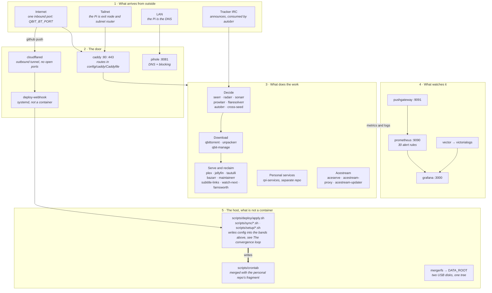
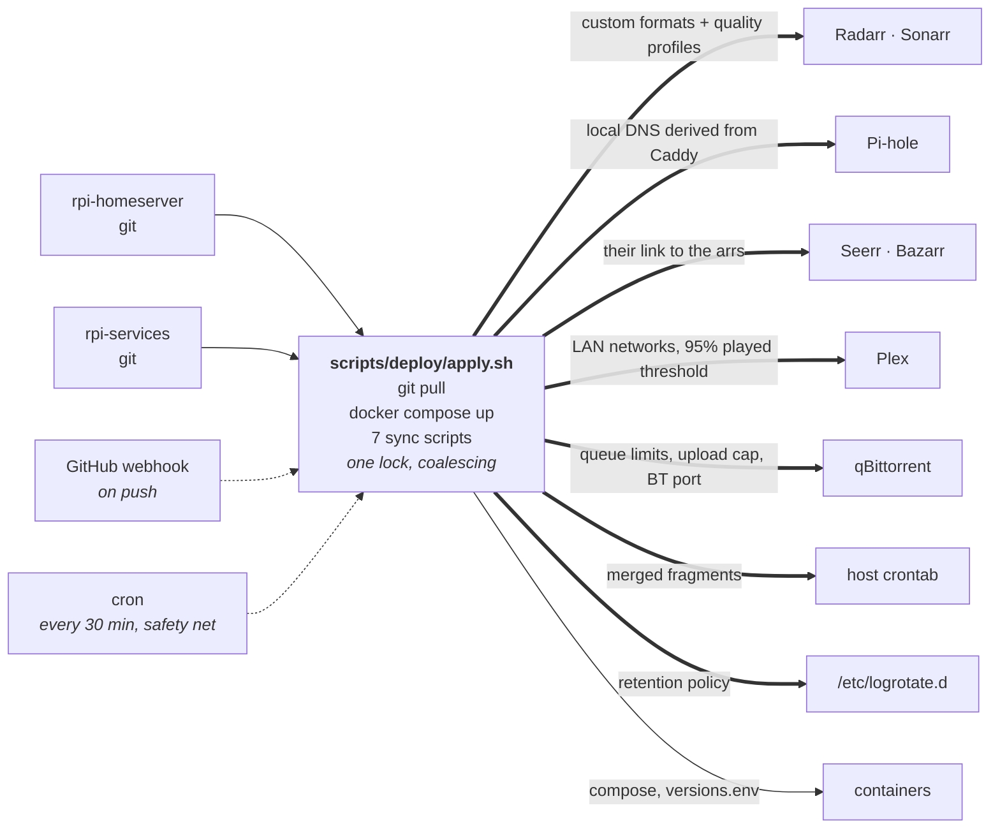
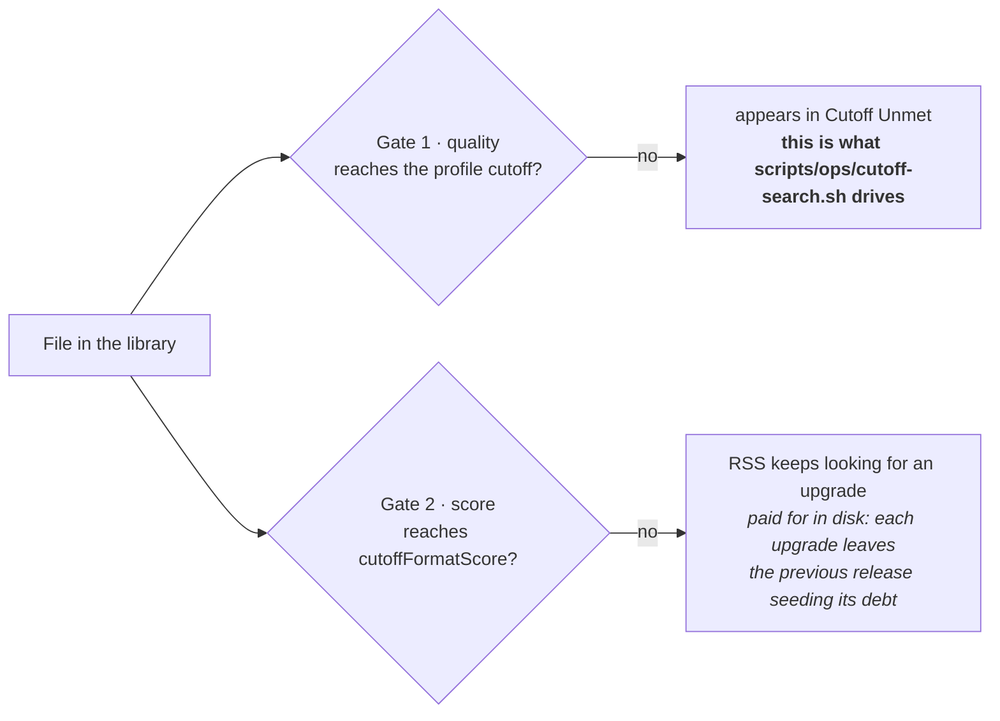
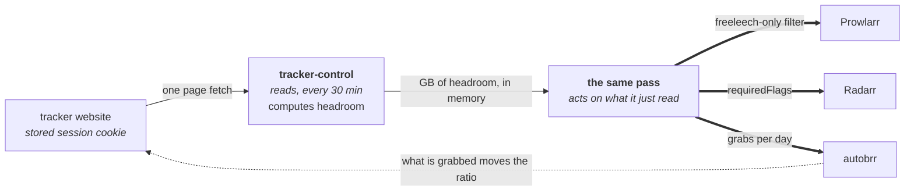
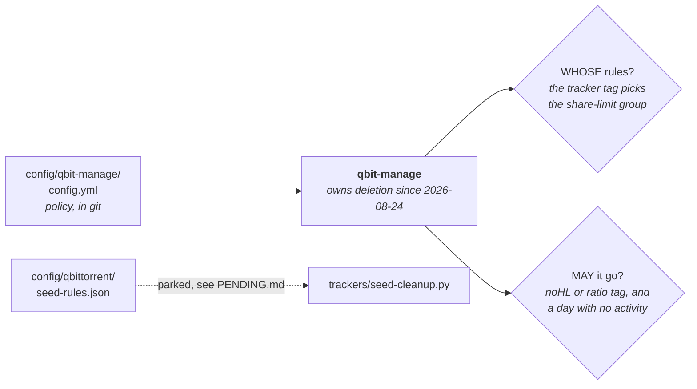
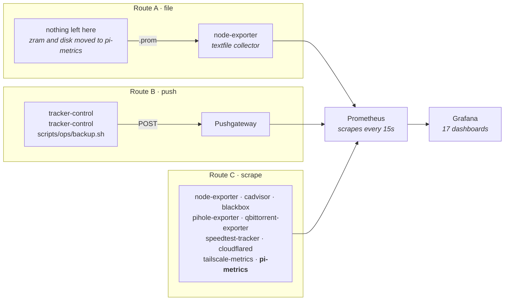
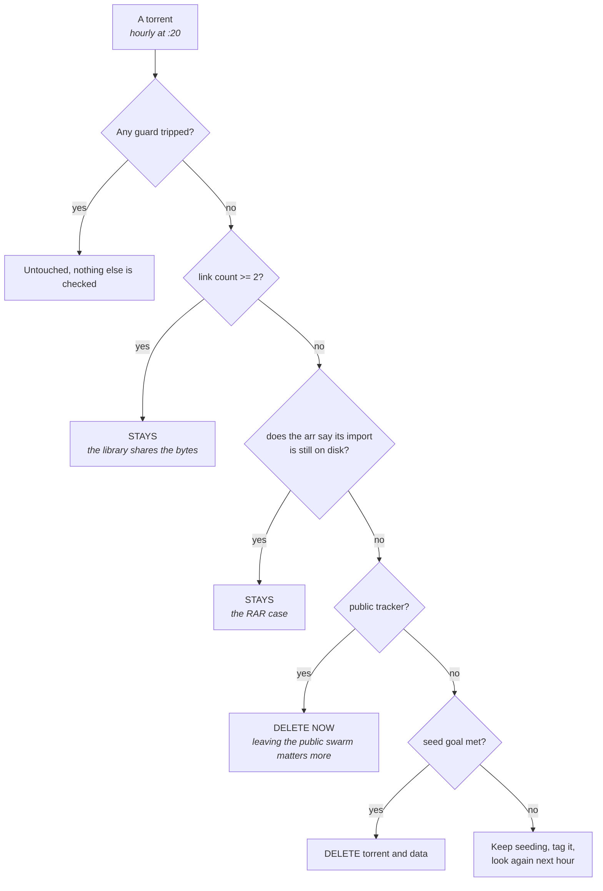
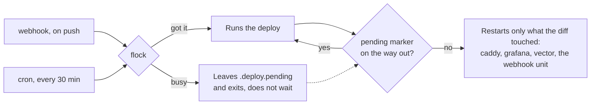

# Architecture

What talks to what, and which component is allowed to overwrite which app's configuration.

Diagrams are Mermaid, which GitHub renders inline. They are the first thing in this repo to use
it: an ASCII box drawing is fine for four boxes, and this file has more than forty.

Everything measured here was measured on 2026-08-22. Counts drift; the shapes do not.

---

## The five bands

41 containers plus one ephemeral at 03:00. All on `media-network` except Plex and Pi-hole, which
use the host network: Plex because it decides "local vs remote" from the source IP, Pi-hole
because it is the LAN's resolver.

---

## The convergence loop

Every 30 minutes, and on every push, `scripts/deploy/apply.sh` pulls both repos and pushes configuration into
each app. Every one of these arrows exists because that setting lives **only inside its app's
own `appdata`**: no compose file and no `.env` captures it, so without this a lost disk silently
loses hours of tuning.

The cron path is dotted because it is not the normal one: it is the net that catches pushes that
arrived while the Pi or the tunnel was down. The lock coalesces rather than queues, so ten pushes
during an ARM Go build cost exactly one extra pass.

### What can overwrite what

| Script | When | Writes into | Source of truth |
| :--- | :--- | :--- | :--- |
| `scripts/sync/arr-config.sh` | every deploy | Radarr, Sonarr | `config/arr/*/*.json` |
| `scripts/sync/qbit-config.sh` | every deploy | qBittorrent | `config/qbittorrent/preferences.json` + `QBIT_BT_PORT` |
| `scripts/sync/plex-prefs.sh` | every deploy | Plex | `PLEX_LAN_NETWORKS`, 95% threshold |
| `scripts/sync/arr-links.sh` | every deploy | Seerr, Bazarr | `config/seerr-links.json` |
| `scripts/sync/pihole-dns.sh` | every deploy | Pi-hole | the Caddy config, additive only |
| `scripts/setup/install-crontab.sh` | every deploy | host crontab | both repos' `scripts/crontab` |
| `scripts/setup/install-logrotate.sh` | every deploy | `/etc/logrotate.d` | `config/logrotate/rpi-homeserver` |
| the tracker-control service | :05 and :35 | Prowlarr, Radarr, autobrr | the measured ratio headroom |
| qbit-manage | hourly | tags, share limits, deletes into the recycle bin | `config/qbit-manage/config.yml` |
| `scripts/ops/cutoff-search.sh` | 05:00 | nothing, triggers a search | Radarr's own Wanted list |

**A profile changed through an app's UI and not committed is reverted within 30 minutes.** That is
the design, not a bug: configuration lives in git, not in `appdata`. Two consequences worth
knowing: profiles are matched **by name**, so renaming one creates a second profile rather than
updating the first; and the sync logs the same "N applied" line whether or not anything changed,
so a revert is invisible in `apply.log`.

### What git does not have

The table above is what git pushes into the apps. This is the other half, and the one that decides
how bad a dead SD card is: what each tool keeps that no file in this repo describes.

| Tool | In git | Only in `appdata`, so only in the backup |
| :--- | :--- | :--- |
| qbit-manage | **everything.** `config/qbit-manage/config.yml`, copied into `appdata` by every deploy | nothing |
| cross-seed | **everything.** `config/cross-seed/config.js`, secrets from the environment | nothing |
| Tracker economy | **everything.** `config/trackers/*.json`, `config/qbittorrent/seed-rules.json` | nothing |
| Grafana | dashboards and alerting, provisioned from `config/grafana/` | starred dashboards, users, silences |
| Radarr, Sonarr | custom formats and quality profiles, pushed by `scripts/sync/arr-config.sh` | indexers, root folders, the library index, history, and the API key everything else authenticates with |
| qBittorrent | preferences and BT port, pushed by `scripts/sync/qbit-config.sh` | categories, tags, and **`BT_backup`, which is every torrent it holds**. Losing that is re-adding 45 torrents by hand and starting every seed clock at zero |
| Plex | LAN networks and the 95% threshold, pushed by `scripts/sync/plex-prefs.sh` | libraries, watch history, and the claim token |
| Prowlarr | **nothing** | every indexer, and each one's API key or passkey, which is why it cannot be in a public repo |
| autobrr | **its three filters**, exported to `config/autobrr/filters.json` | the IRC network and nick, and the download client entry with its password |
| Maintainerr | **its rule group**, exported to `config/maintainerr/rules.json` | its connections to Plex and Seerr, which hold tokens, and the collection, which is rebuilt from the rule |

So one tool still lives entirely in the nightly archive, and it has no choice: every Prowlarr
indexer carries a passkey or an API key and this repo is public. autobrr and Maintainerr used to be
there too, until `scripts/ops/config-export.py` pulled the parts of them that are logic rather than
credentials into `config/`.

That script reads and never writes back, which is the opposite of everything in `scripts/sync/`. The
reason is the blast radius: pushing a filter from a file grabs the wrong thing and costs disk, while
pushing a deletion rule from a file deletes films. So a deploy runs it with `--check` and logs
`[config-drift]` when the live config and the committed copy have parted ways, and a human decides
which one is right. autobrr redacts its own indexer keys in its API (`"rsskey": "<redacted>"`), so
what is committed is the shape of the setup and not the way in.

**The backup is a hot copy, and that is the part to know before trusting it.**
`scripts/ops/backup.sh` tars `appdata` nightly at 04:00 while every container is running, keeps
seven, and pushes `backup_last_status` so a failure alerts. Verified on the 2026-08-24 archive: it
contains `prowlarr.db`, `autobrr.db`, `maintainerr.sqlite`, `radarr.db`, `sonarr.db`,
`qbit-manage/config.yml`, `qBittorrent.conf` and `grafana.db`. Every one of those is SQLite being
written to as tar reads it, and the `-wal` and `-shm` files come along, so a restore usually
recovers cleanly rather than certainly. Nothing here stops the containers first, and that is a
deliberate trade for a backup that never needs a maintenance window.

After a restore, `scripts/recovery/recovery-status.sh` reports what no archive can put back: Plex's
claim token, Jellyfin's setup wizard, and the AirTag 2FA code.

---

## A film, end to end

Moved to [lifecycle.md](lifecycle.md), which follows one file from the indexer that announces it to
the recycle bin, for a film and for an episode, and carries the per-tracker seeding table. What was
here said the hourly `trackers/seed-cleanup.py` does the deleting, and that has been qbit-manage's
job since 2026-08-24.

---

## How Radarr decides a film is finished

Two independent gates. They are easy to confuse because the UI calls both of them a cutoff.

Verified on six films, the pattern held for all six:

| Film | Profile | On disk | Score | In Cutoff Unmet |
| :--- | :--- | :--- | ---: | :--- |
| Inception | Ultra-HD | Bluray-2160p | 400 | no |
| Dune: Part Two | Ultra-HD | Bluray-2160p | 3400 | no |
| Fight Club | HD-1080p | Bluray-1080p | 400 | no |
| The Handmaiden | Ultra-HD | WEBDL-2160p | 0 | yes |
| Society of the Snow | HD + UHD | WEBDL-2160p | 3400 | yes |
| The Odyssey | HD + UHD | WEBDL-1080p | 500 | yes |

The two rows that break the intuition: Society of the Snow scores 3400, well over the 2200 cutoff
score, and is still listed because WEBDL is below the Bluray cutoff. Inception scores 400, under
2200, and is not listed because Bluray-2160p meets the quality cutoff. **Gate 1 decides the list.**

8 of 69 films are in it. Live values: cutoff `Bluray-1080p` on HD-1080p and `Bluray-2160p` on the
other two, `cutoffFormatScore` 2200 on all three.

Setting `cutoffFormatScore` above anything a release can actually score leaves gate 2 permanently
open and the whole library in continuous upgrade search. That is what 10000 did before #42.

---

## The ratio loop: what gets in

The filter belongs in Prowlarr and not in the arrs because `requiredFlags` exists on Radarr's
Torznab indexer and not on Sonarr's: filtering there would leave series unprotected.

TorrentLeech today: ratio 0.821, headroom 67.7 GB, against a threshold of 0.4. Of the private
indexers, only TorrentLeech currently has the freeleech-only filter on. DigitalCore has it off, and
C411 does not expose the field at all, which is why its "freeleech only" rule is a habit rather than
a setting.

---

## Retention policy: what gets out

The ratio loop governs the intake. This governs the release. Different mechanism, different files.

Per tracker: what the site asks, what is configured against it and why the difference, in
[lifecycle.md](lifecycle.md#what-each-tracker-asks-and-what-is-configured). Two conditions have to
agree before anything is deleted, and the second one is the interesting half: a tracker group only
matches a torrent the library has let go of (`noHL`) or that was never in it (`ratio`).

Deletion moves the data to the recycle bin rather than removing it, and nothing empties that
directory today.

---

## Three routes to Grafana

Only one of them notices that the producer has died, which is why things keep moving towards it.

Prometheus's own guidance is that the Pushgateway is for **batch jobs**: something that starts,
computes and exits. Its named cost is exactly the one that matters here, that you lose `up` and that
a pushed series is served forever whether or not anything is still producing it. So route B keeps
only what is genuinely a batch job, the daily backup and the tracker pair, and everything that runs
on a schedule forever has moved to route C.

`pi-metrics` is that move: the media, zram and disk numbers, collected in the background and served
from a snapshot because one media pass takes ~7s against five APIs and a 15s scrape cannot wait for
it. `up` says the process lives and `pi_metrics_last_success_timestamp_seconds` says the data is
fresh, which are two different failures and now two different alerts.

### Is an indexer being used, or just up

`prowlarr_indexer_up` answers "does it answer". It does not answer "is anything being asked of
it", which is the question that matters for a private tracker: an indexer that is up, has been
queried 997 times and has never returned a grab is a different problem from one that is down, and
the availability timeline draws them identically.

`prowlarr_indexer_activity` closes that, from `/api/v1/indexerstats`, as counters so `increase()`
gives the rate over whatever window the panel asks for:

| Metric | Answers |
| :--- | :--- |
| `prowlarr_indexer_queries_total` | is anything searching it |
| `prowlarr_indexer_grabs_total` | does searching it ever produce a download |
| `prowlarr_indexer_failed_queries_total` | is it answering but failing |
| `prowlarr_indexer_response_ms` | is it the one slowing every search down |

Three alerts sit on top, all to Telegram: every indexer down, **any enabled indexer** down for 6h,
and any indexer failing searches for 30m. The middle one used to watch only indexers with 3+ grabs
in 90 days, which was right while every indexer was public and interchangeable and wrong as soon as
private ones arrived: a tracker still inside its newbie window has zero grabs by definition and is
exactly the one whose failure needs saying out loud.

Routes A and B both keep serving a stale value after the producer dies: node-exporter goes on
publishing the `.prom` file, and Pushgateway expires nothing. Two `cutoff_search{app="sonarr"}`
series from 2026-08-04 are still in Pushgateway from a single manual run. Route C is the only one
where death shows up, as `up == 0`.

That is the reason `tailscale-metrics` moved from a cron binary writing a `.prom` file to a
scraped exporter: not tidiness, an alert that did not exist before.

Scrape jobs are in `config/prometheus/prometheus.yml`. `cutoff_search` is currently pushed by
nobody's request: no dashboard and no alert reads it.

---

## The scripts

Twenty-one files under `scripts/`, grouped by what they do rather than by a prefix in the filename.
Measured by lines of code, branches and external calls, three of them earn a drawing and the rest
earn a sentence. `deploy/apply.sh` is sixth by complexity, not first.

| Script | Code | Functions | Branches | Deletes |
| :--- | ---: | ---: | ---: | :--- |
| `services/pi-metrics/media.go` | 610 | 10 | 140 | |
| `trackers/seed-cleanup.py` | 477 | 29 | 116 | files |
| `services/tracker-control` | 1090 | 41 | 190 | config |
| `ops/oci-hunt.py` | 284 | 16 | 61 | |
| `deploy/apply.sh` | 291 | 7 | 75 | |
| the other fifteen | <135 | <6 | <13 | |

### trackers/seed-cleanup.py — parked since 2026-08-24

Not running: qbit-manage owns deletion now, and two deleters with different rules is worse than
either alone. Kept because going back is uncommenting one cron line, and its decision tree is the
reference for what a deleter has to check. See PENDING.md for what has to hold before it goes.

The guards, all of them absolute: outside qBittorrent's own download folder, the library shares the
file, the arrs cannot be reached, progress below 100%, checking or moving, a second torrent shares
the files, or younger than `min_age_hours`. `DRY_RUN=1` prints the decision without acting.

The second question is the one that is not obvious, and the one that stopped live films being
deleted. Radarr imports by hardlink, but a hardlink needs the same bytes at both ends and a scene
release packed in RAR does not have them: unpackerr extracts one `.mkv` out of 96 `.rNN` archives,
and that file is new. 19 of 71 files in the library arrived that way, with a link count of 1 from
the moment they landed, and trusting the count alone read them as watched and deleted while the
film sat in the library untouched.

The seed goal comes from `config/qbittorrent/seed-rules.json`, and whether a tracker is private
comes from qBittorrent itself, so there is no list to keep up to date. The clock is qBittorrent's,
which only advances while the torrent really seeds: stricter than the tracker's calendar, which is
the safe direction to be wrong in.

### deploy/apply.sh

Fifth by complexity, and the part that is not obvious is not the flow, which is the convergence
diagram above. It is the concurrency.

Coalescing, not a queue: ten pushes during an ARM Go build cost exactly one extra pass, not ten.
The marker exists because dropping the skipped run lost real deploys, a tag in one repo and its
version bump in the other arriving inside the same window.

The second thing that is not obvious: **a build that fails is owed a retry**. By the next pass the
commit that caused it has already been pulled, so the diff is empty, the no-change branch runs, and
nothing is ever built again. On 2026-08-31 that left a five-day-old image serving for two hours
across four passes, and the log did not even say so: `cmd | while read; do log; done` reports the
while loop's status and not the command's, so `if !` saw a zero and the metric said the deploy had
applied changes. Every pipeline whose success is checked now goes through `stream_logged`, and a
failed build leaves `.deploy.build-failed.<repo>` holding a count of consecutive failures. Later
passes retry it five times, which is what a transient failure needs, and then stop and leave it to
`deploy_repo_last_status=2` and the alert on it: five minutes of ARM CPU every half hour on a build
that is not going to work is worse than an alert nobody has closed.

### tracker-control

Its complexity is a lookup table, not a flow, so it reads better as one. Headroom is how many GB of
*paid* download still fit before the account crosses the ratio the site disables it at.

| Headroom | Grabs per day | Prowlarr filter |
| :--- | ---: | :--- |
| below 25 GB | 3 | freeleech only |
| below 100 GB | 2 | freeleech only |
| above | 1 | no filter |

More grabs the less headroom is left, which is the opposite of the intuition: with little headroom
the account needs to *build* ratio, and freeleech raises the dividend without touching the divisor.
Below `min_free_gb` the grabber stops entirely. There is no staleness guard any more: the reading and
the action are the same pass, so there is nothing old to act on.

### The rest, one line each

| Script | What it does |
| :--- | :--- |
| `setup/install-crontab.sh` | Merges both repos' cron fragments, installs only if it differs, prints the diff |
| `setup/install-logrotate.sh` | Installs the rotation policy root-owned 0644, because logrotate silently ignores anything else |
| `recovery/rebuild-service.sh` | Rebuilds one compose service from scratch, by hand |
| `recovery/recovery-status.sh` | After a rebuild, the three steps no API can do: Plex claim, Jellyfin wizard, Apple 2FA |
| `sync/arr-config.sh` | Custom formats then quality profiles, in that order: profiles score formats by name and the id only exists once the format does |
| `sync/arr-links.sh` | Seerr and Bazarr's connection to the arrs. Bazarr publishes no port, so its call is proxied through the network |
| `sync/pihole-dns.sh` | Caddy's hosts as local DNS. Additive only: an entry not derived from Caddy is never touched |
| `sync/plex-prefs.sh` | LAN networks, so tailnet clients are not billed as remote, and the played threshold at 95% |
| `sync/qbit-config.sh` | Queue limits and BT port. Reads back after writing, because qBittorrent accepts an unknown key and drops it |
| `services/pi-metrics/media.go` | The largest, but wide rather than deep: ten collectors of the same shape, fetch, count, emit. Answers "which", not "how many" |
| `services/pi-metrics/host.go` | Where the disk went and what zram costs. One walk answers both the largest files and the per-folder totals, counting a hardlinked inode once |
| `services/pi-metrics/main.go` | Serves both from a snapshot refreshed in the background, and exports when each collector last succeeded |
| tracker-control | Reads each site with a stored cookie. The complexity is parsing, deliberately dumb about markup so a second site is config, not a selector hunt |
| `ops/backup.sh` | Compresses appdata, keeps 7, excludes what regenerates (Prometheus TSDB, Plex caches) |
| `ops/heartbeat.sh` | Tells an outside check the Pi is alive, and deliberately fails when the essentials are not running |
| `ops/cutoff-search.sh` | Asks Radarr to search for what it already says is missing. Decides nothing |
| `ops/oci-hunt.py` | Asks Oracle for one of the two free instances every minute, which is its measured rate limit, signing by hand. Counts the runs and logs one summary an hour rather than a line each, and exits for good once both exist |
| `ops/indexer-retry.py` | Probes a backed-off indexer's site and clears Prowlarr's 24 h backoff when it answers, so an hour of blocking does not cost a day |
