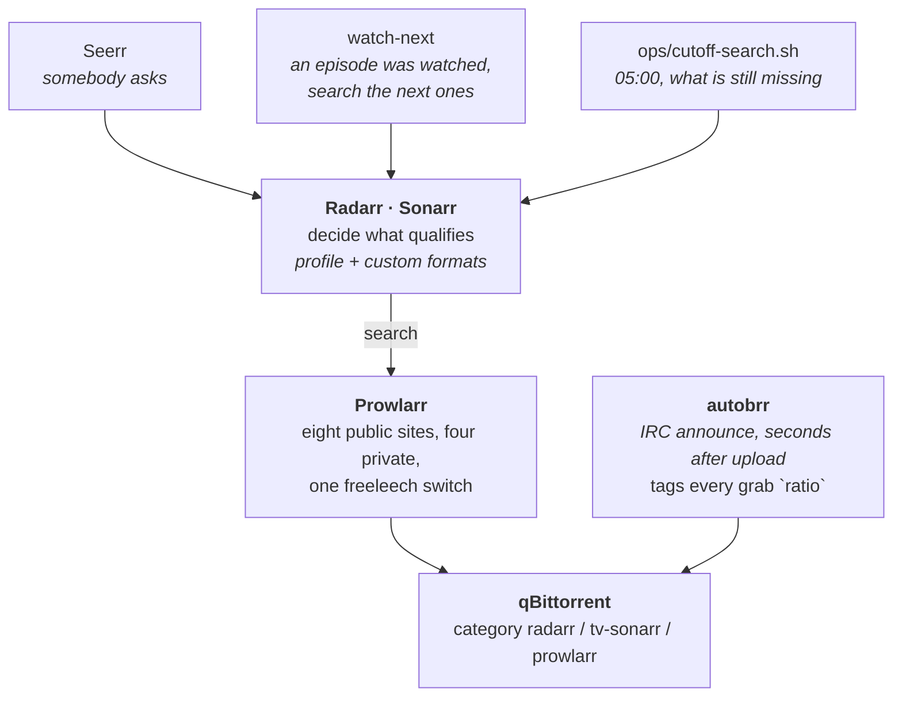
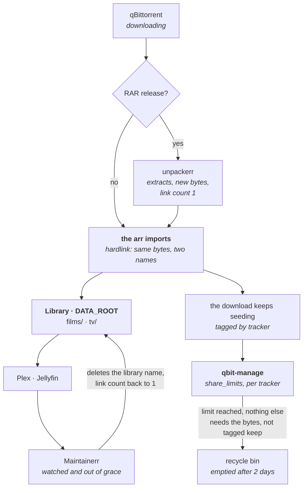

# Lifecycle of a torrent

From the indexer to the recycle bin, for a film and for an episode, naming what decides each hop
and where its number is configured. `architecture.md` says what talks to what; this says what
happens to one file over its whole life.

Two things make this harder than a straight line, and both are here: the same bytes carry two
names (the download and the library hardlink), and each tracker asks for a different amount of
seeding before the torrent may go.

---

## The two ways in

**Asked for** goes through the arrs: they decide whether a release qualifies, Prowlarr searches the
indexers, qBittorrent downloads into the category the arr owns. **Announced** comes from autobrr,
which watches the tracker's IRC channel and grabs within seconds of an upload; nothing in the
library ever wanted those, they exist to build ratio, and they carry the `ratio` tag for the rest
of their life.

The arrs also search on their own: RSS every few minutes catches anything new, so
`ops/cutoff-search.sh` exists only for releases that scrolled out of the feed. It runs at 05:00
because Plex's own nightly maintenance holds 02:00 to 05:00 by default and costs 0.4 cores and
52 MB/s of reads: downloads are the opposite shape, sustained writes, and both land on the same two
USB platters. One job at a time beats seeking between two.

Which of the two gates makes Radarr call a film unfinished is in
[architecture.md](architecture.md#how-radarr-decides-a-film-is-finished). Gate 1, quality, is what
drives that nightly search.

---

## From download to library

The hardlink count is the signal the whole thing rests on: while the library holds the file, the
bytes cost nothing extra, so seeding them is free ratio. Two cases break the count, and both are
handled:

- **RAR releases.** unpackerr writes new bytes, so the extracted file has one link from the moment
  it lands even though the film is in the library. Roughly a quarter of releases arrive that way.
- **Cross-seeds.** A second torrent on the same files keeps the count above 1, so bytes that would
  have been reclaimed after watching stay until the cross-seed goes. No share-limit group can reach
  them either: they sit in the `cross-seed-link` category, and the hardlink check only inspects
  `radarr` and `tv-sonarr`, so they never get `noHL` and no group's `include_any_tags` matches.

An episode follows the same path with one addition: watch-next reacts to Tautulli or Jellyfin
reporting an episode watched and asks Sonarr to search the next `WATCH_NEXT_MARGIN` ones, so a
season fills in progressively instead of all at once. See [watch-next.md](watch-next.md).

---

## The tags are the retention policy

qbit-manage writes a tag per tracker and two more that say who still needs the bytes. Nothing is
ever deleted for one reason alone: a group has to match the tracker **and** find that the file is
free to go.

| Tag | Written by | What it means |
| :--- | :--- | :--- |
| `torrentleech`, `digitalcore`, `c411`, `retrotoon` | qbit-manage, from the announce URL | Which site's rules apply |
| `private` | qbit-manage | The swarm is private. There is no `public` tag: public is the absence of this one, which is how that group selects |
| `noHL` | qbit-manage | The library no longer holds the file, so these bytes are only being kept for the tracker |
| `ratio` | autobrr | Grabbed to build ratio, never in the library. Without this tag they would be invisible here: they carry no category, so the hardlink check never inspects them |
| `stalledDL` | qbit-manage | The download has found no seeder. Written and removed by the tool itself as the state changes, so the `stalled` group only ever holds what is stuck right now |
| `issue` | qbit-manage | The tracker no longer recognises the torrent. Tagged rather than removed, because a reset passkey looks exactly like this |
| `keep`, `keep-bonus` | a person, and tracker-control | Out of the clock: every group excludes them |
| `cross-seed`, `radarr.cross-seed` | cross-seed | A second tracker on bytes another one brought. They sit in the `cross-seed-link` category |

Two exceptions delete on a single condition, and both are somebody else's judgement rather than a
policy here. `rem_unregistered` removes only what the site itself has disowned. The `stalled` group
removes a download that qBittorrent says has found no seeder: it never completed, so it has no
seeding time for a tracker group to wait on, and left alone it would sit at 0% forever.

---

## What each tracker asks, and what is configured

Every site is asked for more than it demands, because two clocks disagree: qBittorrent counts
seeding time from completion and keeps counting while announces are rejected, while the site starts
when it first sees an announce. Measured gaps on this box: 26 to 118 hours across 14 TorrentLeech
torrents, and 9 to 23 hours across five DigitalCore ones. The margin is that gap, not a guess.

| Tracker | The site asks | Configured here | Margin | Why this one |
| :--- | :--- | :--- | :--- | :--- |
| TorrentLeech | 240 h or ratio 1.0 | 15 d, ratio 1.2 | 120 h | The widest measured clock gap of the four |
| DigitalCore | 120 h, clock starts at 10% progress | 180 h, ratio 1.0 | 60 h | Nearly triple the worst gap seen on their own My Seeds page |
| c411 | 72 h, grace of 24 h | 150 h, ratio 1.0 | 54 h | Their H&R system is disabled site-wide, so a thinner margin is affordable |
| retrotoon | 72 h, no ratio rule at all | 120 h, no ratio limit | 48 h | Ratio clears nothing here: only time does, so `max_ratio: -1` |
| anything else private | — | 10 d, ratio 1.0 | — | The floor, so a new site is covered from its first torrent |
| a cross-seed | — | 15 d, no ratio limit | — | Priority 2, above every tracker group. It downloaded nothing, so a ratio limit would fire on its first served byte. 15 d is the longest of the four, so one number covers it wherever it lands |
| anything stalled | — | removed 12 h after the last byte moved | — | Priority 1, so it is seen before its tracker's group, which would wait forever on seeding time a download at 0% can never have. Filtered on `stalledDL`, so a download that finds a seeder again leaves the group |
| public | — | 2 h, no ratio limit | — | Selected as "not tagged private". Time is the closest thing to "as soon as it is imported" this tool offers, and an import takes minutes |

A ratio limit of `-1` means no ratio limit, and two cases need it. Where the site has no ratio rule,
setting one would delete a torrent that still owes seeding time, which is the hit and run the site
is trying to prevent. And a cross-seed downloads nothing at all, so its ratio is upload divided by
zero: the first byte it serves does not land somewhere under 1.0, it blows past any limit at once,
and the copy would be deleted the same hour it started being useful. Hence its own group, above
the trackers', where only time can end it.

`min_last_active: 1d` is the third condition on every private group: a torrent still moving bytes is
still paying, and on a freeleech the download never counted, so every byte up is profit. Any
activity resets it, so something that trickles is kept indefinitely. What stops that from costing
real disk is the free-space floor in `config/trackers/rules.json`, which pauses the grabber.

Deletion moves the files to `/data/downloads/.RecycleBin` rather than removing them, and
`recyclebin.empty_after_x_days: 2` clears them two days later. So a wrong call is recoverable for
two days, and only then does the space come back: the bin sits on the same disk as the downloads it
holds, which is why freeing 76 GiB on 2026-08-25 moved free space *down* until it emptied. The
orphan scan skips `.RecycleBin` and `orphaned_data` for the same reason: they are data parked by the
tool that owns deleting, not data nothing owns.

**The override is a tag.** Every group excludes `keep` and `keep-bonus`, so tagging a torrent in
qBittorrent takes it out of the clock entirely, with no deploy and no config change. `keep` is for a
person; `keep-bonus` is written by tracker-control to hold the data DigitalCore pays a bonus
for.

---

## The lever that runs the whole thing

How hard a tracker is worked is one number: **headroom**, the GB of paid download that still fit
before the account crosses the ratio the site disables it at. Freeleech never moves `downloaded`,
which is why headroom and not ratio decides whether the arrs may take a paid torrent.

The tracker-control service reads it from the site every 30 minutes and acts on it in the same pass,
and the tier table it applies is in
[architecture.md](architecture.md#trackerscontrolpy). The switch lives in Prowlarr, not in the arrs:
`requiredFlags` exists on Radarr's Torznab indexer and not on Sonarr's, so filtering there would
leave series unprotected, and one 20 GB season pack that is not freeleech is the difference between
a working account and a disabled one.

---

## Watching the countdown

The [Lifecycle dashboard](http://grafana/d/media-lifecycle) answers "when does each thing go". It
does not restate the policy: when a `share_limits` group claims a torrent, qbit-manage writes the
limit into qBittorrent itself, so the dashboard subtracts what a torrent has already seeded from the
limit the client is holding. Change a group in `config/qbit-manage/config.yml` and the countdown
follows on its own; there is no second copy of the numbers to keep in step.

That also means a torrent missing from the table is information, not a gap. Two reasons put it
there: no group matched, because the library still shares its bytes, or the group cleared the limit
(`max_ratio: -1`) because the torrent is still moving bytes and still paying for itself. The client
stores `-2` for the first and `-1` for the second, and only a positive limit is a deadline.

Deleting is not freeing. What qbit-manage removes goes to `/data/downloads/.RecycleBin`, on the same
disk, and stays there for `empty_after_x_days`. The dashboard shows what the bin holds, when the
oldest of it is released, and how much of it is actually reclaimable: a file the library still
hardlinks frees nothing when the bin empties.

## Where each number lives

| Decision | File |
| :--- | :--- |
| What qualifies as a release | `config/arr/radarr`, `config/arr/sonarr` (formats and profiles) |
| Which indexers, and the freeleech switch | Prowlarr, written by tracker-control |
| Grabs per day for ratio | autobrr filter, written by tracker-control |
| How long each tracker is seeded | `config/qbit-manage/config.yml`, `share_limits` |
| What the site actually asks | `config/trackers/rules.json`, one entry per tracker |
| When the library copy goes | Maintainerr rule, exported to `config/maintainerr` |
| Queue limits and BT port | `config/qbittorrent`, written by `sync/qbit-config.sh` |

Site rules read on 2026-08-21 from each tracker's own rules page; the entries in
`config/trackers/rules.json` carry the date they were checked. Per-site detail, including what each
one rewards, is in [private-trackers.md](private-trackers.md).
